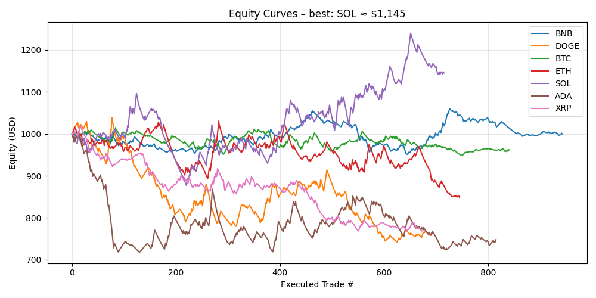
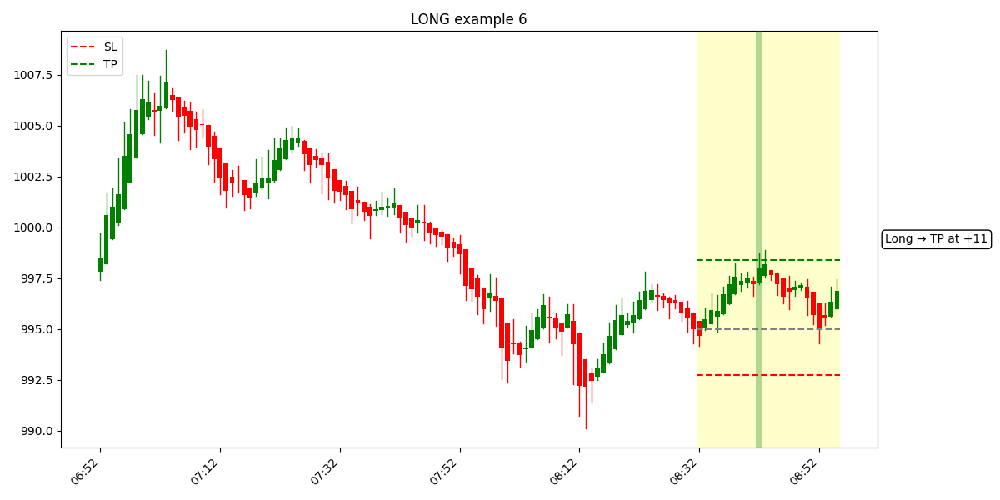

# ml-bert-heikin-ashi

A BERT-style masked-LM pipeline on **Heikin-Ashi mid-price** tokens for financial time-series classification and trade simulation.  
Instead of predicting the next OHLCV token like a GPT-2 model, this repo builds a full pipeline—from raw bid/ask bars through VQ-VAE tokenization to BERT pretraining and fine-tuning for **long/short/hold** signals.

*Pretrain MLM results (context 100 + [CLS]):*  

| Epoch | Train Loss | Val Loss | Train MLM Acc | Val MLM Acc |
|------:|-----------:|---------:|--------------:|-----------:|
| 1     | 3.542377   | 2.811335 | 20.65 %       | 25.85 %    |
| 2     | 2.643270   | 2.716302 | 28.73 %       | 27.09 %    |
| 3     | 2.645028   | 2.639274 | 28.08 %       | 28.30 %    |
| 4     | 2.544951   | 2.664655 | 29.71 %       | 27.83 %    |
| 5     | 2.593996   | 2.661840 | 28.92 %       | 27.86 %    |

*Signal classification (June 2025, 15 m):*

```
              precision    recall  f1-score   support

        Long       0.15      0.42      0.23       897
       Short       0.19      0.53      0.28      1085
        Hold       0.75      0.30      0.43      5799

    accuracy                           0.35      7781
   macro avg       0.36      0.42      0.31      7781
weighted avg       0.60      0.35      0.39      7781
```

> **Equity Curve (June 2025)**  
>   
> The equity curve above starts at 1 000 USD and fluctuates across coins, peaking at ~1 145 USD for SOL, but overall underperforms. Note: this curve uses a different selection of trades than what our data creation script made. Do note that if you implemented a fee per trade this equity curve would deplete to $0.

## Example: Creating Signals

> **Example Heikin-Ashi & TP/SL**  
>   
> This chart shows how a single Heikin-Ashi window is labeled **Long**: the entry is at the current close, the red line marks stop-loss (1×ATR), and the green line marks take-profit (1.5×ATR).

## What this repo does

1. **Download raw bid/ask data** from Dukascopy via CLI.  
   *`ml-data-engineering/download_dukascopy.py`*  
2. **Stochastic normalize** Heikin-Ashi mid-price OHLC bars.  
   *`ml-data-engineering/stochastic_normalize.py`*  
3. **Tokenize** normalized bars via VQ-VAE → integer tokens.  
   *`ml-data-engineering/tokenize_data.py`*  
4. **Generate signals** with ATR SL/TP on Heikin-Ashi mid-prices.  
   *`ml-data-engineering/signal_data.py`*  
5. **Train VQ-VAE** on normalized bars (1 536-codebook).  
   *`ml-data-engineering/train_vqvae.py`*  
6. **Pretrain** BERT masked-LM on token sequences.  
   *`ml-model-training/src/train_bert.py`*  
7. **Fine-tune** BERT for signal classification.  
   *`ml-model-training/src/train_signal.py`*  

## Folder layout (important files)

```
ml-data-engineering/
  download_dukascopy.py
  stochastic_normalize.py
  tokenize_data.py
  signal_data.py
  train_vqvae.py
  plots/              # sample signal-vs-future plots
  models/             # normalizer.joblib, vqvae encoder, decoder, vocab.json

ml-model-training/
  logs/               # classification_report.txt, confusion_matrix.png, equity_curve.png
  src/
    data/             # dataset.py
    network/          # model.py, blocks/
    utils/            # misc.py, scheduler.py
    train_bert.py
    train_signal.py
```

## Quick‑start

```bash
git clone https://github.com/rsenatorov/ml-bert-heikin-ashi.git
cd ml-bert-heikin-ashi
python -m venv .venv && source .venv/bin/activate  # Windows: .venv\Scripts\activate
pip install -r requirements.txt

python ml-data-engineering/download_dukascopy.py
python ml-data-engineering/stochastic_normalize.py
python ml-data-engineering/tokenize_data.py
python ml-data-engineering/signal_data.py
python ml-data-engineering/train_vqvae.py
python ml-model-training/src/train_bert.py
python ml-model-training/src/train_signal.py
```

## Disclaimer

- The equity curve and classification metrics uses a different script of creating data.  
- No fees, slippage, latency, or order-book modeling.  
- Use at your own risk.

## License

MIT © 2025 **Robert Senatorov**

## Citation

```
@misc{ml-bert-heikin-ashi,
  author = {Robert Senatorov},
  title  = {ml-bert-heikin-ashi: BERT on Heikin-Ashi financial tokens},
  year   = {2025},
  url    = {https://github.com/rsenatorov/ml-bert-heikin-ashi.git}
}
```
